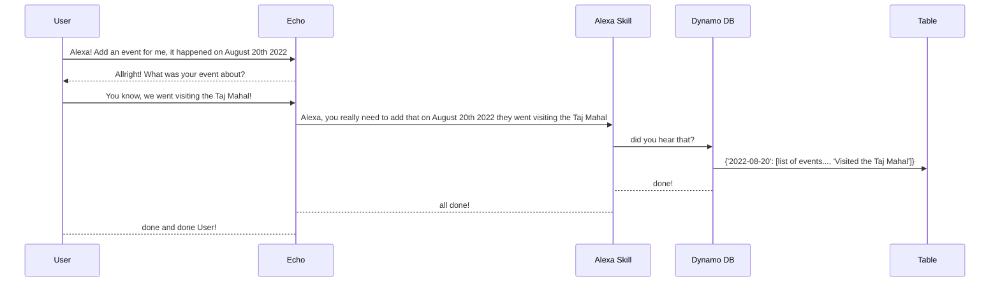

# kamaji
This repo helds the code for manipulation of data for a Calendar Alexa Skill (that will be documented too, at certain point).
The skill works more or less like this

```mermaid
sequenceDiagram
    User->>Echo: Alexa! Add an event for me, it happened on August 20th 2022
    Echo-->>User: Allright! What was your event about?
    User->>Echo: You know, we went visiting the Taj Mahal!
    Echo->>Alexa Skill: Alexa, you really need to add that on August 20th 2022 they went visiting the Taj Mahal
    Alexa Skill->>Dynamo DB: did you hear that?
    Dynamo DB->>Table: {'2022-08-20': [list of events..., 'Visited the Taj Mahal']}
    Dynamo DB-->Alexa Skill: done!
    Alexa Skill-->Echo: all done!
    Echo-->User: done and done User!
```
