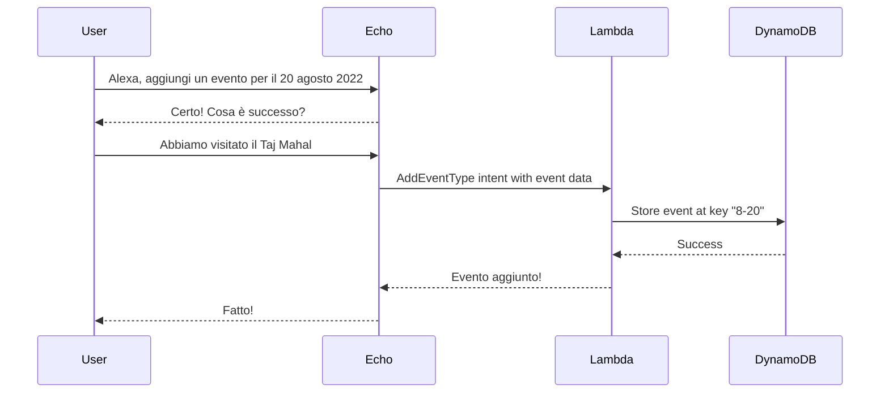

# Kamaji

An Alexa-hosted skill for managing personal calendar events via voice, with a CLI tool for generating activity heatmaps.

## Overview

Kamaji is a calendar skill for Amazon Alexa that allows users to:
- Add events to specific dates via voice commands
- Retrieve events that happened on specific dates
- Modify or delete existing events
- Navigate through events by year

The skill is primarily in Italian and uses DynamoDB for persistent storage.



## Project Structure

```
kamaji/
├── lambda/                      # Alexa Skill Lambda function
│   ├── lambda_function.py       # Entry point
│   ├── handlers/                # Intent handlers
│   ├── interceptors/            # Request/response logging & localization
│   ├── exceptions/              # Error handling
│   ├── utils/                   # Utility functions (date parsing, attributes)
│   ├── constants/               # Intent names, slot names, session keys
│   └── language_strings.json    # Localization strings (Italian + English)
├── kamaji/                      # CLI tool for heatmap generation
│   └── kamaji.py
├── tests/                       # Unit tests
├── interactionModels/           # Alexa interaction model
│   └── custom/it-IT.json
├── .github/workflows/           # CI/CD pipeline
│   └── deploy-skill.yml
├── skill.json                   # Skill manifest
└── pyproject.toml               # Poetry configuration
```

## Prerequisites

- Python 3.10 or 3.11
- [Poetry](https://python-poetry.org/) for dependency management
- Node.js 20+ (for ASK CLI during deployment)

## Installation

```bash
# Clone the repository
git clone https://github.com/your-username/kamaji.git
cd kamaji

# Install dependencies
poetry install
```

## Running Tests

Tests are written using pytest and located in the `tests/` directory.

```bash
# Run all tests
poetry run pytest

# Run with verbose output
poetry run pytest -v

# Run specific test file
poetry run pytest tests/test_handlers.py

# Run with coverage (if configured)
poetry run pytest --cov=lambda
```

The pytest configuration in `pyproject.toml` sets:
- Test path: `tests/`
- Python path: `lambda/` (for imports)

## CLI Tool: Activity Heatmap

Kamaji includes a CLI tool for generating activity heatmaps from exported DynamoDB data.

```bash
# Generate heatmap from exported CSV
poetry run kamaji --activities-file-path backup.csv --output-file-path heatmap.png
```

### Exporting Data from DynamoDB

1. Go to [Alexa Developer Console](https://developer.amazon.com/alexa/console/ask)
2. Navigate to your skill → Code → DynamoDB Database
3. Click "Explore table items"
4. Select the item and go to Actions → Download selected items to CSV

The CSV should have headers `"id","attributes"` with attributes in JSON format.

## Deployment

The project uses GitHub Actions for automated deployment to Alexa-hosted infrastructure.

### Deployment Flow

- **Push to `main` branch** → Deploys to the `master` branch (development/staging)
- **Push a version tag (`v*`)** → Deploys to the `prod` branch (production)

### Required GitHub Secrets

Configure these secrets in your GitHub repository settings (Settings → Secrets and variables → Actions):

| Secret | Description | How to Obtain |
|--------|-------------|---------------|
| `LWA_REFRESH_TOKEN` | Login with Amazon refresh token | See [Obtaining LWA Credentials](#obtaining-lwa-credentials) |
| `LWA_CLIENT_ID` | OAuth client ID | From LWA Security Profile |
| `LWA_CLIENT_SECRET` | OAuth client secret | From LWA Security Profile |
| `ASK_VENDOR_ID` | Alexa Skills Kit vendor ID | From [ASK Developer Console](https://developer.amazon.com/settings/console/mycid) |
| `ALEXA_SKILL_ID` | Your skill's unique ID | From Alexa Developer Console (skill page URL or `ask smapi list-skills-for-vendor`) |

### Obtaining LWA Credentials

1. **Create a Security Profile** in [Login with Amazon Console](https://developer.amazon.com/loginwithamazon/console/site/lwa/overview.html):
   - Click "Create a New Security Profile"
   - Fill in name and description
   - Note down the **Client ID** and **Client Secret**

2. **Configure Web Settings**:
   - In your Security Profile, go to Web Settings
   - Add `http://localhost:9090/cb` as an Allowed Return URL

3. **Get the Refresh Token** using ASK CLI:
   ```bash
   # Install ASK CLI
   npm install -g ask-cli@2

   # Initialize ASK CLI (this will open a browser for authentication)
   ask configure

   # After authentication, the refresh token is stored in ~/.ask/cli_config
   # Extract the refresh_token value from the JSON file
   cat ~/.ask/cli_config | jq '.profiles.default.token.refresh_token'
   ```

4. **Get your Vendor ID**:
   - Go to [Alexa Developer Console Customer ID page](https://developer.amazon.com/settings/console/mycid)
   - Your Vendor ID is displayed on that page

5. **Get your Skill ID**:
   - Go to [Alexa Developer Console](https://developer.amazon.com/alexa/console/ask)
   - Click on your skill
   - The Skill ID is in the URL or can be found in the skill's "Build" tab under "Endpoint"
   - Alternatively: `ask smapi list-skills-for-vendor`

### Manual Deployment

If you need to deploy manually:

```bash
# Install ASK CLI
npm install -g ask-cli@2

# Configure ASK CLI
ask configure

# Deploy (from the repo root)
git push <alexa-hosted-remote> HEAD:master
```

## Voice Commands (Italian)

| Action | Example Phrase |
|--------|----------------|
| Add event | "Alexa, aggiungi un evento per il 20 agosto" |
| Retrieve events | "Alexa, cosa abbiamo fatto il 20 agosto?" |
| Modify events | "Alexa, modifica gli eventi del 20 agosto" |
| Navigate events | "prossimo" |
| Delete event | "cancellalo" |

## Development

### Code Style

The project uses:
- **black** for code formatting
- **flake8** for linting

```bash
# Format code
poetry run black lambda/ tests/

# Lint code
poetry run flake8 lambda/ tests/
```

### Adding New Handlers

1. Create a new handler class in `lambda/handlers/`
2. Inherit from `BaseHandler` (provides utility methods)
3. Implement `can_handle()` and `handle()` methods
4. Register the handler in `lambda/lambda_function.py`

## License

[Add your license here]
