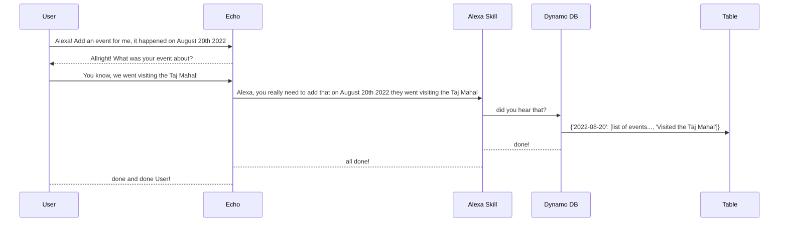

# kamaji
This repo helds the code for manipulation of data for a Calendar Alexa Skill (that will be documented too, at certain point).
The skill works more or less like this

## How to
As I still need to understand how to retrieve access keys from my alexa's skill account to conenct to dynamo db (not even sure it's possible :\), by navigating to the `Alexa Developer Console`, then `DynamoDB Database`, then `Explore table items`, select the item, then `Action` and `Download selected items to CSV`. That's the file required by `Kamaji` to work.

The file is supposed to have header `"id","attributes"` and only one row. Attributes must be in JSON format.
